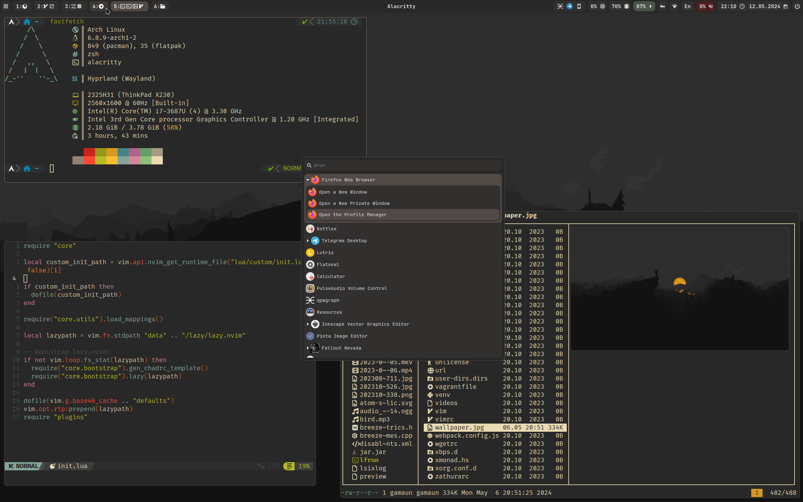

## Dotfiles for:

#### [Alacritty](https://github.com/alacritty/alacritty)
With gruvbox theme

#### [Neovim](https://github.com/neovim/neovim)
Slightly tweaked [NvChad](https://github.com/NvChad/NvChad)

#### [lf](https://github.com/gokcehan/lf) (TUI file manager)
Custom `lfrc` with all necessary functions:
  - Create tar.gz or zip archive
  - Extract to the current or a new directory (works on all selected files)
  - Chmod (work on all selected files)
  - Bulk rename (copied from Luke's lfrc)  
  - Drag-and-drop (using [blobdrop](https://github.com/vimpostor/blobdrop))
  - Create symlink (works on all selected files)
  - Follow symlink
  - Previewer script with image support (using [ueberzugpp](https://github.com/jstkdng/ueberzugpp)/kitty/[chafa](https://github.com/hpjansson/chafa))
  - And more

#### zsh
 - No oh-my-zsh bloat, only a few plugins:
   - [p10k prompt](https://github.com/romkatv/powerlevel10k)
   - [autosuggestions](https://github.com/zsh-users/zsh-autosuggestions)
   - [history search](https://github.com/zsh-users/zsh-history-substring-search)
   - [syntax highlighting](https://github.com/zsh-users/zsh-syntax-highlighting)

#### tmux
very basic config, as i don't use it much

#### Bookmarks/shortcuts for neovim, lf, and zsh
Configured in `~/.config/shell/bm-files` and `~/.config/shell/bm-dirs` (run `ref` after editing those)

#### [HOME directory cleanup](https://wiki.archlinux.org/title/XDG_Base_Directory)
- Most of the configs are now in `~/.config`
- Changed paths are in `~/.config/shell/profile`

### [Hyprland](https://github.com/hyprwm/Hyprland)
- Panel: [Waybar](https://github.com/Alexays/Waybar)
- Lockscreen: [Hyprlock](https://github.com/hyprwm/hyprlock)
- Launcher/dmenu: [Wofi](https://hg.sr.ht/~scoopta/wofi)
- Wallaper utility: [Hyprpaper](https://github.com/hyprwm/hyprpaper)
- Notification daemon: [Dunst](https://github.com/dunst-project/dunst)
- Clipboard manager: [Cliphist](https://github.com/sentriz/cliphist)

## Install script
Just run `./install.sh --help` to see available options. 

**All affected files will be backed up**

## Special Thanks to

[Luke Smith's Voidrice](https://github.com/LukeSmithxyz/voidrice) for inspiration, scripts and configs
